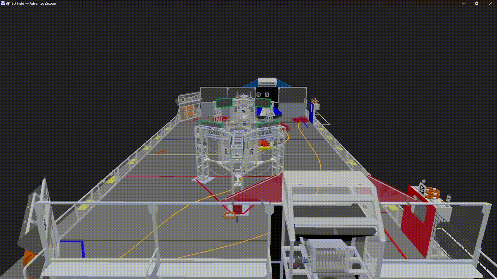

# Phantom-DriveBase

### Swerve Drive Robot Template with Advanced Features

## Driving

- **Field Centric Swerve** with 100% custom kinematics.
- **Drive Wheels Feedforward** via Look-Up-Table.
- **Acceleration Constraining** during pilot controlled period.
- **Robot Configuration Storage** in JSON files.
- **Robot Status Visualization** through dashboard, led and [Networktables-Alerts](https://github.com/Mechanical-Advantage/NetworkAlerts).

## Auto

- **Decisive Autonomous Framework** with custom auto-follower, allowing robots to “react to its surroundings”.
- **Multiple Path-Planning Tools Selectable**, including PathPlanner, Choreo, PathWeaver and

## Logging

Built Upon Advantage Kit, everything is logged and recorded for after-match analysis

[GitHub - Mechanical-Advantage/AdvantageKit: Monorepo for robot framework and tools](https://github.com/Mechanical-Advantage/AdvantageKit)

## Vision

[GitHub - Shenzhen-Robotics-Alliance/FRC-Phantom-Vision: a rapid, powerful, easy-to-use and open-source vision framework for FRC](https://github.com/Shenzhen-Robotics-Alliance/FRC-Phantom-Vision)

- **April-tag Robot Localization** Custom filtering mechanism and odometer calibration algorithm, compatible with photon-vision.
- **Auto Alignment** code, set-to-go for coming seasons.
- **360° Game-Piece Detection** running on Jetson-Orin-Nano coprocessor.

## Robot Digital-Twin Engine

- **Uses Actual Robot Code** in the simulator. This means that you can tune Auto-Stages, PIDs, Auto-Scoring functions and more.  The simulator display robots through Advantage Scope.

[GitHub - Mechanical-Advantage/AdvantageScope: Robot telemetry application](https://github.com/Mechanical-Advantage/AdvantageScope)

- **Swerve-Drive Physics Simulation**, fine-tuned with experimental data measured in our training field, as well as real-life data gathered from real competitions this year.
    
    
    
- **2D Rigid-Body Collision Simulation** for game-pieces and robots on field.

- **Opponent Robots Simulation** that can either be controlled by a gamepad to play defense or follow pre-stored cycle paths.

